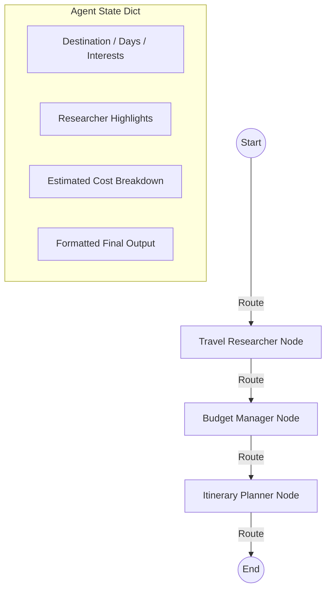

# ✈️ AeroPlan: Multi-Agent Travel Planner

AeroPlan is a production-ready, beautiful, and fully functional **Multi-Agent Travel Planner** built using **LangGraph**, **FastAPI**, and a stunning glassmorphic web interface. It generates personalized travel itineraries complete with real-time costs, routing directions, and offline map features.

---

## 📸 Screenshots

Here are previews of the dashboard in action:

| Dashboard Main View | Custom Dark styled Google Map |
| :---: | :---: |
|  |  |

| Live Graph State Transitions | Beautiful Telugu Localization |
| :---: | :---: |
|  |  |

---

## 🛠️ Tech Stack

### Backend
- **LangGraph**: State machine orchestrator to coordinate travel agents.
- **LangChain**: LLM calling framework.
- **FastAPI & Uvicorn**: High-performance async web server and Server-Sent Events (SSE) streaming API.
- **Wikipedia API**: Secondary source for fetching tourist attractions.
- **OSRM (Open Source Routing Machine)**: Driving/walking directions routing engine.
- **Nominatim OpenStreetMap**: Geocoding engine (address/name to coordinates conversion).

### Frontend
- **Vanilla HTML5 & CSS3**: Glassmorphic UI, glowing borders, dark mode theme, pulsing active nodes, and clean animations.
- **Vanilla JavaScript**: SSE chunk parser, dynamic script bootloader, and interactive map handlers.
- **Google Maps JS SDK**: Features custom dark maps and high-performance `AdvancedMarkerElement` pins.
- **Leaflet.js**: Auto-fallback maps engine with CartoDB Dark Matter tile layers.

---

## 🏛️ System Architecture

AeroPlan utilizes a state-machine architecture managed by **LangGraph**. The workflow progresses sequentially between nodes:



### 1. Travel Researcher Node
- Researches top tourist spots, food places, and local tips using interests.
- Integrates the `wikipedia` library to get actual city details dynamically if no LLM key is configured.

### 2. Budget Manager Node
- Estimates costs across category groups (lodging, dining, transit, activities).
- Performs currency conversion dynamically (supporting USD, EUR, JPY, GBP, INR, and CAD).
- Validates the budget limit and tags warning flags if thresholds are exceeded.

### 3. Itinerary Planner Node
- Integrates the researcher notes and budget details.
- Resolves coordinates using Nominatim OpenStreetMap and queries **OSRM** to fetch driving directions step-by-step.
- Formats a beautiful markdown response localized to the user's selected language (supports English, Spanish, Japanese, French, German, Hindi, and Telugu).

---

## 🚀 How to Run the Application

### 1. Prerequisites & Setup
Clone the repository and navigate to the project directory:
```powershell
cd Project-Agent
```

Create and activate the virtual environment:
```powershell
# Create venv
python -m venv .venv

# Activate venv
.venv\Scriptsctivate
```

Install the dependencies:
```powershell
pip install -r requirements.txt
```

### 2. Configuration (`.env`)
Create a `.env` file in the root directory:
```env
OPENAI_API_KEY="your_openai_api_key"
GOOGLE_MAPS_API_KEY="your_google_maps_api_key"
```
*(Note: If `OPENAI_API_KEY` is not present, the system runs in high-fidelity Simulation Mode. If `GOOGLE_MAPS_API_KEY` is not configured, the map defaults to Leaflet.js).*

### 3. Run the CLI Version
Start the interactive CLI:
```powershell
python main.py
```
Or run directly with arguments:
```powershell
python main.py --destination "Kyoto, Japan" --days 3 --interests "Temples, Food" --budget 120000 --currency INR --language Telugu
```

### 4. Run the Web Dashboard Locally
Start the FastAPI server:
```powershell
python server.py
```
Open your browser and navigate to: **[http://localhost:8000](http://localhost:8000)**

---

## 🌐 Deployment Instructions

Follow these steps to deploy AeroPlan to a public URL.

### 1. Host the Backend on Render
Render is beginner-friendly and ideal for Python APIs.

1. **Push your code** to a GitHub repository.
2. **Create a Render account** and connect your GitHub profile.
3. Click **"New" ➔ "Web Service"** and select your repository.
4. Configure the settings:
   - **Environment**: `Python`
   - **Build Command**: `pip install -r requirements.txt`
   - **Start Command**: `uvicorn server:app --host 0.0.0.0 --port 8000`
5. Under **"Environment"**, add your API keys:
   - `OPENAI_API_KEY` (optional for simulation mode)
   - `GOOGLE_MAPS_API_KEY` (optional for Leaflet fallback)
6. Click **Deploy**. Render will build the serverless web service and provide you with a live URL (e.g., `https://aeroplan-api.onrender.com`).

---

### 2. Host the Frontend on Vercel or Netlify
You can host the static web dashboard (`/web` directory) on Vercel or Netlify for lightning-fast loads.

1. **Connect the Backend**:
   Open [web/script.js](web/script.js) in your codebase. At the very top, set the `BACKEND_URL` variable to your live Render backend URL:
   ```javascript
   const BACKEND_URL = "https://aeroplan-api.onrender.com"; // Replace with your live Render URL
   ```
2. **Push changes** to your GitHub repository.
3. **Deploy the frontend**:
   - **On Vercel**: Connect your GitHub repository, choose standard settings, and select `/web` as the root directory (or keep standard settings if deploying the whole repo, since Vercel automatically routes static files).
   - **On Netlify**: Click "New Site from Git", choose your repository, and set the publish directory to `web/`.
4. Deploy again. The frontend will now communicate with your live Render backend instead of localhost!

*Note: If you want to deploy both the frontend and backend in one place, Vercel natively builds the whole app (FastAPI backend + static files) together using the included [vercel.json](vercel.json) file.*

---

### 3. Setup Custom Domain & HTTPS
To make it feel like a professional, standalone product:
1. **Buy a domain name** via Namecheap, GoDaddy, or Google Domains.
2. In your hosting provider's panel (Vercel, Netlify, or Render), add your custom domain (e.g., `aeroplan.in`).
3. **Configure DNS Records** with your registrar:
   - Point an **A Record** to the hosting IP, or a **CNAME Record** to the hosting default domain.
4. **HTTPS** is automatically provisioned and managed for free via **Let's Encrypt** on Vercel, Netlify, and Render.
