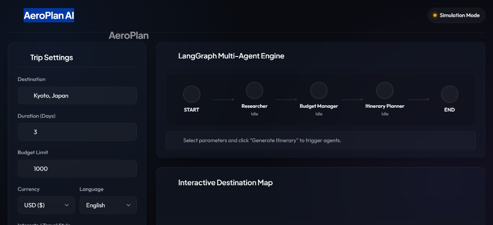
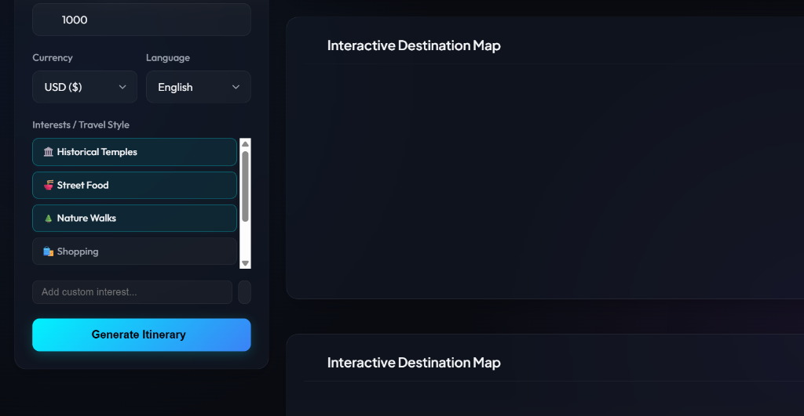
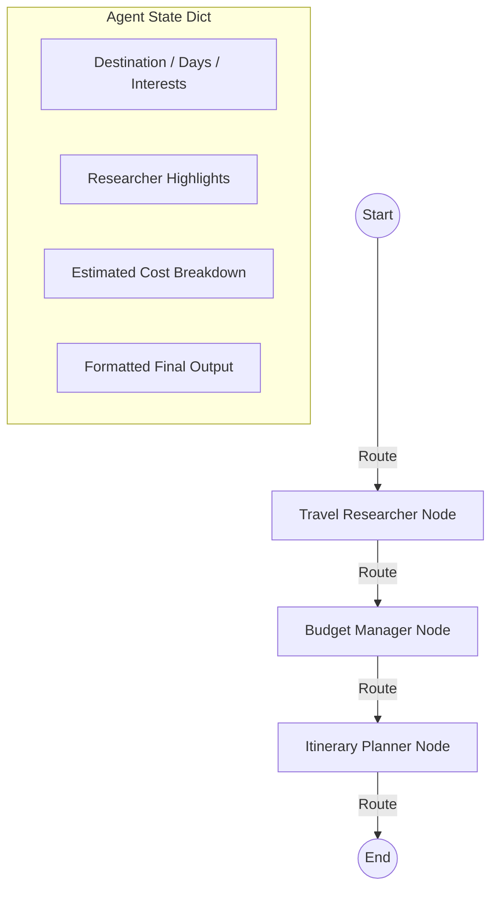

# ✈️ AeroPlan: Multi-Agent Travel Planner

AeroPlan is a production-ready, beautiful, and fully functional **Multi-Agent Travel Planner** built using **LangGraph**, **FastAPI**, and a stunning glassmorphic web interface. It generates personalized travel itineraries complete with real-time costs, routing directions, and offline map features.

---

## 📸 Screenshots

Here are previews of the dashboard in action:

| Dashboard Main View | Custom Dark styled Google Map |
| :---: | :---: |
|  |  |

| Live Graph State Transitions | Beautiful Telugu Localization |
| :---: | :---: |
|  |  |

---

## 🌟 Key Features & Advancements

### 🔒 1. Authentication System & User Dashboard
- **Glassmorphic Login/Signup Modal**: Custom dark-themed authentication overlay with password validation, password strength checks, password visibility toggles, and simulated Google/GitHub OAuth mock buttons.
- **Header Profile Panel**: Shows the logged-in user's email, initials avatar, and logout controls.
- **My Saved Trips Section**: A dedicated tab containing the user's travel plans history, offering features to:
  - **Load**: Instantly populates the active itinerary, research, budget notes, and interactive map pins.
  - **Rename**: Edit trip labels in-place.
  - **Delete**: Safely delete trip records (with verification).
- **Dual Persistence Storage Model**:
  - **Local Server (`db.json`)**: Persistently saves user credentials (with secure SHA-256 password hashing + unique user-specific salts) and trip plans to a local database file in the project root.
  - **Vercel Sandbox Fallback (`localStorage`)**: Automatically shifts to client-side localStorage if the serverless API reports a read-only environment or goes offline, ensuring user trips persist across tab closures and device restarts.

### 📄 2. Native PDF Export & ICS Calendar Sync
- **High-Fidelity Native PDF Print Engine**: Bypasses pixelated or clipped canvas screenshots by utilizing the browser's native print dialog (`window.print()`) with print-media overrides (`@media print` CSS), compiling a vector-sharp, copyable, ink-saving PDF.
- **RFC-Compliant iCalendar Sync (.ics)**: Dynamically extracts scheduled events and times from generated travel plans and compiles them into a calendar file importable into Google Calendar, Outlook, or Apple Calendar.

### 💸 3. Cost Fact-Checking & Safety budget overrides
- **Real-World Price Database**: Compiles a curated `REAL_WORLD_COST_DB` matching actual ticket prices for major attractions (e.g. Wonderla ticket price set to ₹1,252).
- **Survival Budget Floors**: Enforces realistic budget limits per city (e.g. $20/day accommodation floor, $12/day dining floor) to prevent automated budgets from scaling costs below survival limits.
- **Tight Budget Banners**: Displays multilingual alerts (English, Hindi, Telugu) warning travelers if their budget limit is too low for the chosen destination.

### 🚗 4. Upgraded turn-by-turn routing
- **Google Directions Integration**: If `GOOGLE_MAPS_API_KEY` is present, fetches live driving routes with distances, durations, and step details.
- **OSRM Fallback**: Utilizes OSRM/Nominatim OpenStreetMap engines for routing coordinates and steps if no Google API key is configured.
- **Multilingual Backups**: Automatically uses structured local routes if API queries fail.

### 🗺️ 5. Map Resize Invalidation
- Listens to window resizing to invalidate the Leaflet map container dynamically using `leafletMap.invalidateSize()`, preventing grey layout gaps on responsive screen sizes.

---

## 🛠️ Tech Stack

### Backend
- **LangGraph**: State machine orchestrator to coordinate travel agents.
- **LangChain**: LLM calling framework.
- **FastAPI & Uvicorn**: High-performance async web server and Server-Sent Events (SSE) streaming API.
- **Wikipedia API**: Secondary source for fetching tourist attractions.
- **OSRM (Open Source Routing Machine)**: Driving/walking directions routing engine.
- **Nominatim OpenStreetMap**: Geocoding engine.

### Frontend
- **Vanilla HTML5 & CSS3**: Glassmorphic UI, glowing borders, dark mode theme, pulsing active nodes, and clean animations.
- **Vanilla JavaScript**: SSE chunk parser, dynamic script bootloader, and interactive map handlers.
- **Google Maps JS SDK**: Features custom dark maps and high-performance `AdvancedMarkerElement` pins.
- **Leaflet.js**: Auto-fallback maps engine with CartoDB Dark Matter tile layers.

---

## 🏛️ System Architecture

AeroPlan utilizes a state-machine architecture managed by **LangGraph**. The workflow progresses sequentially between nodes:



### 1. Travel Researcher Node
- Researches top tourist spots, food places, and local tips using interests.
- Integrates the `wikipedia` library to get actual city details dynamically if no LLM key is configured.

### 2. Budget Manager Node
- Estimates costs across category groups (lodging, dining, transit, activities).
- Performs currency conversion dynamically (supporting USD, EUR, JPY, GBP, INR, and CAD).
- Validates the budget limit and tags warning flags if thresholds are exceeded.

### 3. Itinerary Planner Node
- Integrates the researcher notes and budget details.
- Resolves coordinates using Nominatim OpenStreetMap and queries OSRM or Google Directions API to fetch driving directions step-by-step.
- Formats a beautiful markdown response localized to the user's selected language (supports English, Spanish, Japanese, French, German, Hindi, and Telugu).

---

## 🚀 How to Run the Application

### 1. Prerequisites & Setup
Clone the repository and navigate to the project directory:
```powershell
cd Project-Agent
```

Create and activate the virtual environment:
```powershell
# Create venv
python -m venv .venv

# Activate venv
.venv\Scripts\activate
```

Install the dependencies:
```powershell
pip install -r requirements.txt
```

### 2. Configuration (`.env`)
Create a `.env` file in the root directory:
```env
OPENAI_API_KEY="your_openai_api_key"
GOOGLE_MAPS_API_KEY="your_google_maps_api_key"
```
*(Note: If `OPENAI_API_KEY` is not present, the system runs in Simulation Mode. If `GOOGLE_MAPS_API_KEY` is not configured, the map defaults to Leaflet.js).*

### 3. Run the CLI Version
Start the interactive CLI:
```powershell
python main.py
```
Or run directly with arguments:
```powershell
python main.py --destination "Kyoto, Japan" --days 3 --interests "Temples, Food" --budget 120000 --currency INR --language Telugu
```

### 4. Run the Web Dashboard Locally
Start the FastAPI server:
```powershell
python server.py
```
Open your browser and navigate to: **[http://localhost:8000](http://localhost:8000)**

---

## 🌐 Deployment Instructions

Follow these steps to deploy AeroPlan to a public URL.

### Host the Entire Application on Vercel
Vercel natively builds both the frontend and Python backend together using the included [vercel.json](vercel.json) file.

1. **Push your code** to a GitHub repository.
2. **Create a Vercel account** and connect your GitHub profile.
3. Click **"Add New" ➔ "Project"** and select your repository.
4. Set the environment variables in Vercel project settings:
   - `OPENAI_API_KEY` (optional for simulation mode)
   - `GOOGLE_MAPS_API_KEY` (optional for Leaflet fallback)
5. Click **Deploy**. Vercel will build the serverless functions and host the static files under a single domain.
6. The app will automatically fall back to **localStorage** client-side persistence for its auth and saved trips features due to Vercel's read-only serverless environment.
